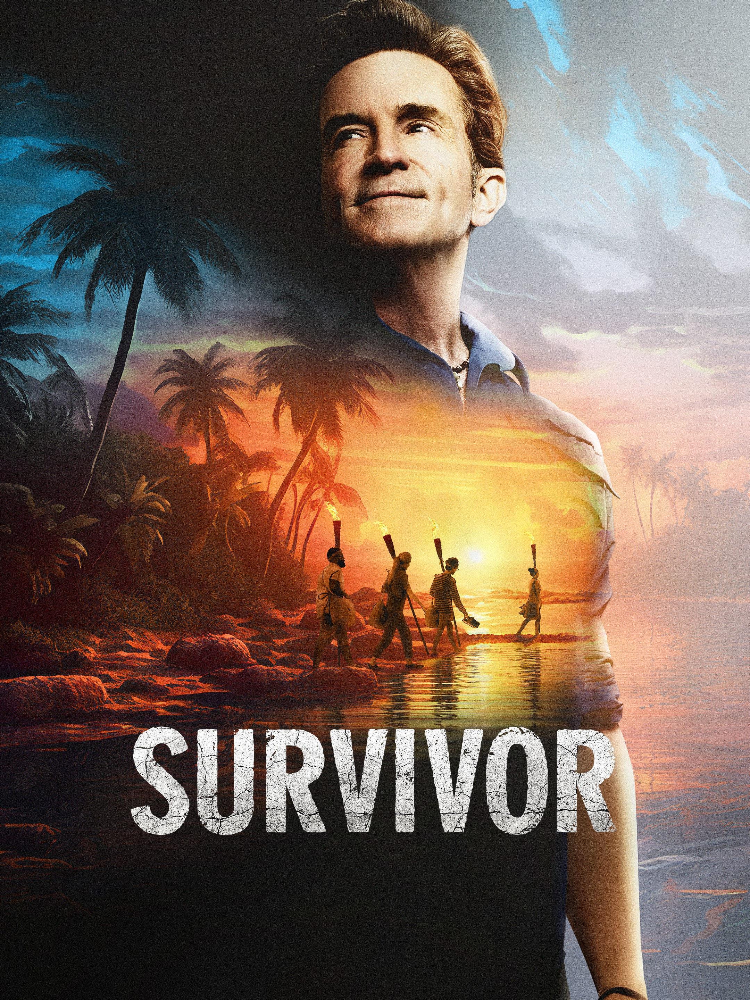

# PredictingSurvivorWinners

Reality television has been a prominent genre in modern day entertainment ever since it's conception in the late 20th century. However, it wasn't until the early 2000s where reality television truly soared to new heights through the introduction of social and strategic competitions. Shows such as _Big Brother_, _The Amazing Race_, and, of course, _Survivor_, completely changed the realm of reality television. These shows all involved casts of real people navigating unpredictable and unique social environments. _Survivor_ was one of the most noticeable television shows of this time. The first season transformed the landscapes of social strategic television competitions as audiences eagerly tuned in every week to see who would be voted out.

_Survivor_ follows a group of castaways who are stranded on an island and divided into tribes. Every episode, they compete in a variety of physical and mental challenges to win rewards and immunity from elimination. The climax of each episode occurs at Tribal Council where the players vote for one of their own to be eliminated from the game. This process continues until there are only 2-3 players left standing. At this point, a jury is formed from the eliminated players who now have power in deciding who wins the game. The jury votes for a winner out of the remaining players and this player wins the million dollar cash prize and the title of **Sole Survivor**.
