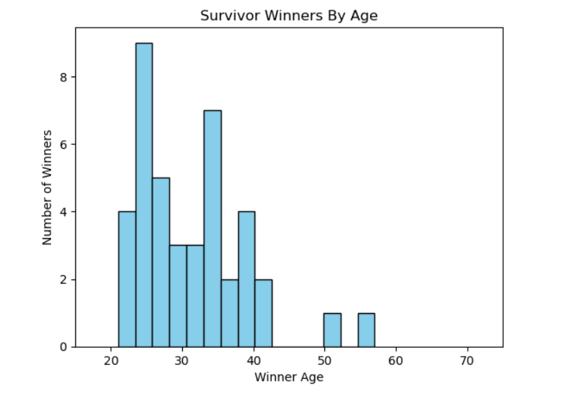

# Stats With Survivor!

## Marooning (Introduction)

Reality television has been a prominent genre in modern day entertainment ever since it's conception in the late 20th century. However, it wasn't until the early 2000s where reality television truly soared to new heights through the introduction of social and strategic competitions. Shows such as _Big Brother_, _The Amazing Race_, and, of course, _Survivor_, completely changed the realm of reality television. These shows all involved casts of real people navigating unpredictable and unique social environments. _Survivor_ was one of the most noticeable television shows of this time. The first season transformed the landscapes of social strategic television competitions as audiences eagerly tuned in every week to see who would be voted out.

_Survivor_ follows a group of castaways who are stranded on an island and divided into tribes. Every episode, they compete in a variety of physical and mental challenges to win rewards and immunity from elimination. The climax of each episode occurs at Tribal Council where the players vote for one of their own to be eliminated from the game. This process continues until there are only 2-3 players left standing. At this point, a jury is formed from the eliminated players who now have power in deciding who wins the game. The jury votes for a winner out of the remaining players and this player wins the million dollar cash prize and the title of **Sole Survivor**.

My passion for data science actually started with shows like _Survivor_. As a kid, I really enjoyed watching _Total Drama_ which led me to start watching the reality show that it was based on which is _Survivor_. I thought it was so cool seeing all of these entertaining players and cutthroat gameplay. My fascination led me to create a notebook filled with all kinds of statistics about the players and the game. Every season, I created numerous graphs and charts covering the gameplay. This inspired me to follow my path in data science.

## Immunity Challenge (Data Storytelling)

Using matplotlib on Python, we can show some correlations in the dataset. For example, how might a player's age impact their chances of winning the game? Below is a histogram showing the distribution of _Survivor_'s player's ages. Compare this to the distribution of the ages of _Survivor_ winners.

They are mostly similar, except we can see that the range of winners is smaller than the one including all contestants. No players under the age of 20 or over the age of 58 have won the game yet. A majority of winners are either in their mid 20's or mid 30's. These are the best age groups to bet on if you are trying to predict who the winner of the season will be. This is because older players typically get voted out earlier and younger players aren't respected as much due to their lack of life experience.

Now, let's look at the impact that race could have on a player's game. Below is a graph showing the distribution of winners by their race. Compare this to the distribution of all _Survivor_ players by their race.

As we can see, the distribution of _Survivor_ winners is almost identical to the distribution of _Survivor_ players before the BIPOC rule was initiated at CBS. This rule was a response to the Black Lives Matter movement of 2020 where casts of non-scripted television shows on CBS network now had to comprise of at least 50% people of color. Before this rule, the cast was heavily favored towards non people of color where white people made up on average about 70% of the cast. This is why they ended up also making up a majority of the winners. However, after this rule was introduced, 4/5 past winners have been people of color. As it turns out, having a more diverse cast of players lead to having a more diverse group of winners (who would've thought!). I predict that eventually the pie graph for winners ethnicity will look pretty similar to the _Survivor_ players after the BIPOC rule. 

These graphs could indicate that a _Survivor_ player's race might not have a major impact on their chances of winning as the sample's distribution is very similar to the population's distribution.

## Tribal Council (Predicting Player's Placement)

With the information specified above, how could we possibly use this information to create a model that might be able to predict a player's placement? Would it even be possible to create a model that could predict a _Survivor_'s placement with almost 100% certainty? 

## Finale (Conclusion)
